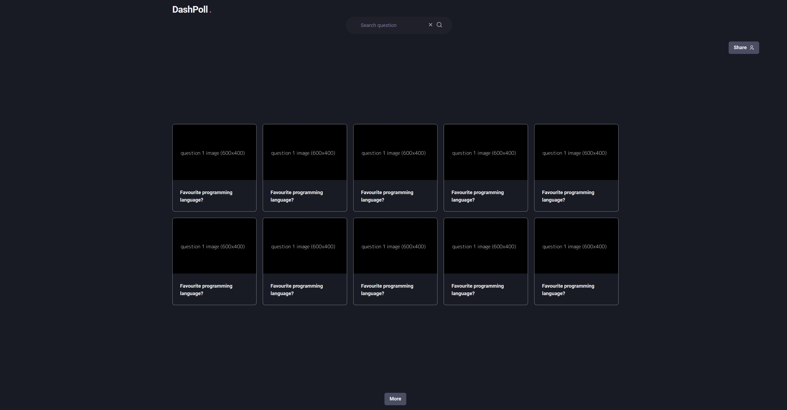
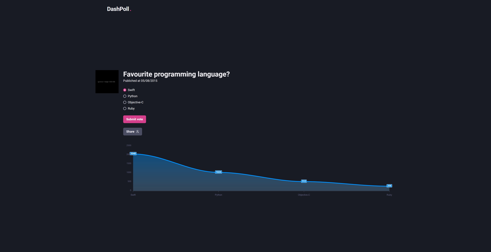
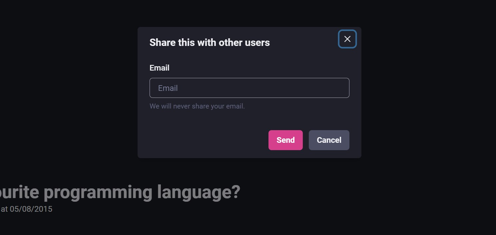
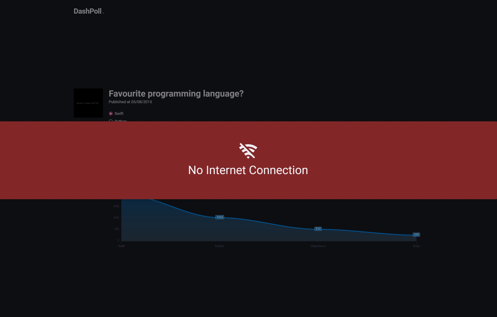

## Summary

This application was made for people to vote in polls

## How to

- Run development

Make sure the Node is up to date
-- yarn
-- yarn dev

## Preview

# Tools

- Next.js
- Typescript
- Chakra UI
- React icons
- Axios - Fetch Library
- React Query - for data synchronization
- Apexcharts - for chart votes
